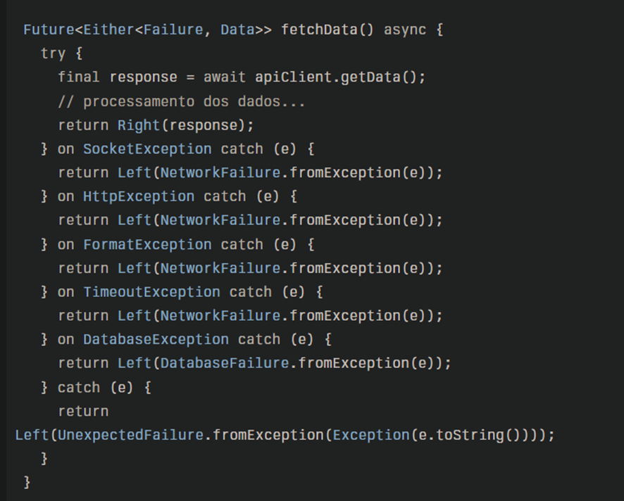

# Documentação do Projeto

## Estrutura do Projeto

O projeto segue a Clean Architecture, organizado em camadas bem definidas para facilitar a manutenção, testabilidade e escalabilidade. Abaixo está a estrutura atualizada do projeto:
Aqui está uma sugestão de estrutura de pastas baseada na Clean Architecture:
Estrutura de Pastas
lib/
├── core/                          # Componentes reutilizáveis e utilitários
│   ├── error/                     # Tratamento de erros (Ex: Exceptions, Failure)
│   ├── network/                   # Gerenciamento de rede (Ex: API client)
│   └── utils/                     # Funções auxiliares (ex: helpers, validadores)
│
├── features/                      # Funcionalidades específicas do app
│   ├── movie/                     # Funcionalidade relacionada ao filme
│   │   ├── data/                  # Fontes de dados (API, DB)
│   │   │   ├── models/            # Modelos de dados (ex: Movie, Session)
│   │   │   ├── datasources/       # Fontes de dados (API, DB, cache)
│   │   │   └── repositories/      # Implementação dos repositórios
│   │   ├── domain/                # Lógica de negócios e entidades
│   │   │   ├── entities/          # Entidades do domínio (ex: Movie, Session)
│   │   │   ├── repositories/      # Interfaces dos repositórios
│   │   │   └── usecases/          # Casos de uso (ex: GetMoviesUseCase)
│   │   └── presentation/          # Interface com o usuário (UI)
│   │       ├── screens/           # Telas (ex: MovieListScreen)
│   │       ├── widgets/           # Componentes reutilizáveis
│   │       └── blocs/             # Gerenciamento de estado (Bloc, Cubit, etc)
│   │
│   └── payment/                   # Funcionalidade de pagamento
│       ├── data/                  # Fontes de dados (API, DB)
│       │   ├── models/            # Modelos de dados (ex: Payment, PaymentResponse)
│       │   └── datasources/       # Fontes de dados (API, pagamento simulado)
│       ├── domain/                # Lógica de negócios e entidades
│       │   ├── entities/          # Entidades do domínio (ex: PaymentMethod)
│       │   └── usecases/          # Casos de uso (ex: ProcessPaymentUseCase)
│       └── presentation/          # Interface com o usuário (UI)
│           ├── screens/           # Telas (ex: PaymentScreen)
│           └── blocs/             # Gerenciamento de estado (Bloc, Cubit, etc)
│
├── injection_container/           # Injeção de dependências (DI)
│   └── service_locator.dart       # Configuração de injeção de dependências
├── main.dart                      # Ponto de entrada da aplicação
└── routes.dart                    # Definição de rotas (se necessário)
Explicação das Pastas
1.	core/: Aqui ficam componentes reutilizáveis que são comuns a toda a aplicação. Isso inclui tratamentos de erros, manipulação de rede (clientes HTTP, interceptadores),  entre as funcionalidades e funções utilitárias (como validadores ou formatação de dados).
2.	features/: Cada funcionalidade do seu aplicativo é tratada em uma pasta dentro de features. Neste caso, temos funcionalidades como "movie" para lidar com filmes e "payment" para o pagamento.
o	data/: Contém os repositórios, fontes de dados (API, banco de dados, cache), e modelos de dados que serão usados pelas camadas superiores.
o	domain/: Contém a lógica de negócios, entidades do domínio (que representam os dados principais do sistema, como Filme, Sessão, Pagamento), interfaces dos repositórios e casos de uso que representam operações específicas.
o	presentation/: A camada de apresentação é responsável pela interação com o usuário. Ela contém telas (widgets principais), componentes reutilizáveis (botões, cards) e o gerenciamento de estado (usando Bloc, Cubit, Provider, etc.).
3.	injection_container/: Gerencia a injeção de dependências do seu projeto, garantindo que as dependências entre as camadas (API, Repositórios, Casos de Uso) sejam bem gerenciadas e desacopladas.
4.	main.dart: Ponto de entrada do aplicativo Flutter, onde você configura o ambiente, a navegação inicial e as dependências necessárias.
5.	routes.dart: Para um projeto maior, você pode querer centralizar a definição de rotas da aplicação para facilitar manutenção e escalabilidade.
Como Funciona a Comunicação entre as Camadas?
1.	Camada de Dados (Data Layer): A camada de dados é responsável por buscar ou persistir os dados. Por exemplo, ela pode consumir uma API externa (como a API de filmes ou a API de pagamento). Essa camada retorna modelos simples (como MovieModel) ou respostas de sucesso/erro (como PaymentResponse).
2.	Camada de Domínio (Domain Layer): O domínio é a camada central da sua aplicação e é onde reside a lógica de negócios. Aqui, você define as entidades (como Movie, Session, PaymentMethod) e os casos de uso (como GetMoviesUseCase ou ProcessPaymentUseCase). Essa camada não deve depender de detalhes de implementação, como API ou UI.
3.	Camada de Apresentação (Presentation Layer): Esta camada é a interface com o usuário e é responsável por coletar dados da camada de domínio para exibir na UI. Utilizando Blocs ou Providers, ela gerencia o estado e as interações do usuário. Por exemplo, ao selecionar um filme, o MovieListScreen irá chamar um caso de uso como GetMoviesUseCase para buscar os filmes e exibi-los.
Exemplo de Fluxo de Dados para "Compra de Ingresso"
1.	Tela Inicial: O usuário vê a lista de filmes em cartaz. A UI chama o UseCase GetMoviesUseCase da camada de domínio, que por sua vez interage com o repositório na camada de dados para buscar filmes de uma API externa.
2.	Tela de Detalhes: O usuário escolhe um filme e a tela de detalhes mostra mais informações sobre o filme. A UI chama o caso de uso GetMovieDetailsUseCase, que pode buscar detalhes adicionais do filme.
3.	Pagamento: Após escolher o filme, o usuário entra na tela de pagamento. Aqui, um caso de uso como ProcessPaymentUseCase é acionado para processar o pagamento com a API ou serviço de pagamento.
4.	Impressão de Ingresso: O pagamento é confirmado, e um caso de uso na camada de domínio gera o ingresso e o cupom de pagamento, que são enviados à camada de dados para serem salvos ou enviados para impressão.
Benefícios da Estrutura:
•	Desacoplamento: A estrutura com Clean Architecture ajuda a manter cada camada independente, facilitando testes, manutenções e substituições de tecnologias em cada camada sem impactar o sistema como um todo.
•	Escalabilidade: Novas funcionalidades podem ser adicionadas com facilidade, criando novas camadas dentro das pastas de features.
•	Facilidade de Testes: Cada camada pode ser testada isoladamente, garantindo que a lógica de negócios (domínio) não dependa de detalhes da apresentação ou de dados específicos.
Com essa estrutura, você consegue gerenciar bem o desenvolvimento do app, mantendo o código organizado, reutilizável e fácil de testar. O que acha dessa organização?

PADRONIZAÇÃO DA CAMADA DE ERROS 

Para estruturar a pasta de erros no seu app Flutter usando Clean Architecture, uma abordagem organizada e clara é dividir os erros em subpastas específicas conforme a origem ou tipo do erro. Isso facilita a manutenção, o entendimento e o tratamento adequado em cada camada da arquitetura.
Uma sugestão de estrutura para a pasta error seria:
lib/
 └── core/
      └── error/
           ├── network/         // Erros relacionados a consumo de API, conexão, timeouts
           │     ├── network_failure.dart
           │     └── timeout_failure.dart
           ├── database/        // Erros relacionados a banco de dados local, SQLite, Hive etc.
           │     ├── database_failure.dart
           │     └── cache_failure.dart
           ├── general/         // Erros gerais, inesperados, validações comuns
           │     ├── unexpected_failure.dart
           │     └── validation_failure.dart
           └── failure.dart     // Classe base ou interface para falhas (Failure)
Detalhes importantes para essa estrutura:
•	Classe base Failure: Crie uma classe abstrata ou interface Failure que será a base para todos os tipos de erro. Isso obriga o tratamento explícito dos erros em toda a aplicação, conforme boas práticas da Clean Architecture.
•	Separação por domínio do erro: Dividir erros de rede, banco de dados e gerais em subpastas ajuda a manter o código organizado e facilita a extensão futura.
•	Localização na camada core: Geralmente, erros são definidos numa camada core ou domain, pois representam conceitos de falha que podem ser usados em várias camadas, inclusive domínio e dados.
•	Exemplos de erros específicos: Para rede, erros como NetworkFailure, TimeoutFailure; para banco, DatabaseFailure, CacheFailure; para gerais, UnexpectedFailure, ValidationFailure são comuns.
Como usar
•	Nos casos de uso (domain/usecases), você pode retornar um Either<Failure, Success> (usando pacotes como dartz) para indicar sucesso ou falha.
•	Na camada de dados (infra/data), implemente a captura de exceções específicas e converta para as classes de Failure correspondentes.
•	Na apresentação (UI/presentation), trate os erros para exibir mensagens amigáveis ao usuário.
Essa organização segue a ideia de desacoplamento e clareza da Clean Architecture, facilitando testes e manutenção.

Exemplo de implementação
 
